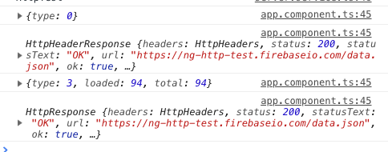

# HttpClient

## 0. import `HttpClientModule`

Before using `HttpClient`, please import `HttpClientModule` in your `app.module.ts`.

## 1. example

```ts
constructor(private httpClient: HttpClient) {
  }

storeServers(servers: Server[]) {
    const headers = new HttpHeaders()
        .append('Content-Type', 'application/json');
    const params = new HttpParams()
      .append('auth', 'something');

    return this.httpClient.post('https://ng-http-test.firebaseio.com/data.json', servers, {
        headers,
        params,
        observe: 'body',
        responseType: 'text',
    });
}

getServers() {
    return this.httpClient.get<Server[]>('https://ng-http-test.firebaseio.com/data.json')
        .pipe(
            map(servers => servers.map(server => {
                server.name = `FETCHING_${server.name}`;
                return server;
            })),
            catchError(err => throwError(`something error: `, err))
      );
  }
```

```ts
onSaveServers() {
    this.serverService.storeServers(this.servers).subscribe(
      res => console.log(res),
      err => console.log(err)
    );
  }

  onGetServers() {
    this.serverService.getServers().subscribe(
      servers => this.servers = servers,
      err => console.log(err)
    );
  }
```

Note:

-   All `HttpClient` package is import from `@angular/common/http`.
-   You need inject `HttpClient` in your service before you use it.
-   `HttpClient` returns an `Oberservable`, you need to subscribe to use the result.
-   you can define options in `post/get/put` method. You can use `observe`, `responseType` or other options.
-   you can use rxjs operator like `map`, `filter` or `catchError` operator with `pipe()`
-   With `HttpClient`, you can define generic type when using `get` or other method like `his.httpClient.get<Server[]>(url)`
-   Sometimes you can use `async` pipe to get the http response in template.

## 2. Get the progress. Always useful for upload/download

```ts
getRequest() {
    const req = new HttpRequest('GET', 'https://ng-http-test.firebaseio.com/data.json', {
      reportProgress: true
    });
    return this.httpClient.request(req);
  }
```

```ts
onGetRequest() {
    this.serverService.getRequest().subscribe(
      res => {
        console.log(res);
      },
      err => console.log(err)
    );
  }
```

The result is something like this:



Note:

In the result, you will receive the `HttpEventType`. The `HttpEventType` is the following Enum:

```ts
export declare enum HttpEventType {
    /**
     * The request was sent out over the wire.
     */
    Sent = 0,
    /**
     * An upload progress event was received.
     */
    UploadProgress = 1,
    /**
     * The response status code and headers were received.
     */
    ResponseHeader = 2,
    /**
     * A download progress event was received.
     */
    DownloadProgress = 3,
    /**
     * The full response including the body was received.
     */
    Response = 4,
    /**
     * A custom event from an interceptor or a backend.
     */
    User = 5
}
```

You can use this `HttpEventType` to get the different progress.

## 3. interceptor

```ts
import { Injectable } from '@angular/core';
import { HttpEvent, HttpHandler, HttpInterceptor, HttpRequest } from '@angular/common/http';
import { Observable } from 'rxjs';

@Injectable()
export class AppInterceptor implements HttpInterceptor {
    intercept(req: HttpRequest<any>, next: HttpHandler): Observable<HttpEvent<any>> {
        console.log('App interceptor.....');
        return next.handle(req);
    }
}
```

Note:

-   After you create `interceptor`, you need provide it in `app.module.ts`.

    ```ts
    providers: [
        {provide: HTTP_INTERCEPTORS, useClass: AppInterceptor, multi: true},
    ],
    ```

-   In webstorm, you can use `nginterceptor` to trigger the snippet.
