# Flex

## 1. Basic

- main axis: Flex容器的主轴主要用来配置Flex项目, 默认是水平方向
- cross axis: 与主轴垂直的轴称作侧轴, 默认是垂直方向的
- direction: 默认**主轴从左向右**, **侧轴默认从上到下**
- 主轴和侧轴并不是固定不变的, 通过flex-direction可以互换

1. flex row: 从左到右排列

      ```css
      section:nth-child(2) ul{
          /*让ul 采用伸缩布局*/
          display: flex;
          /* 主轴水平排列(default, 可以不写)*/
          flex-direction: row;
      }
      ```

      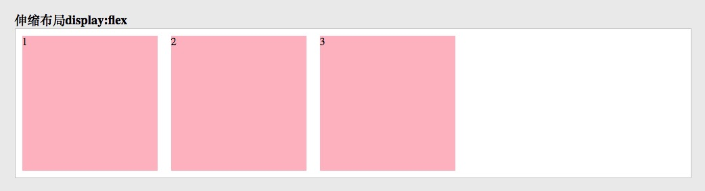

2. flex column: 从上到下排列

      ```css
      section:nth-child(3) ul{
          /*让ul 采用伸缩布局*/
          display: flex;
          /* 主轴垂直排列*/
          flex-direction: column;
      }
      ```

      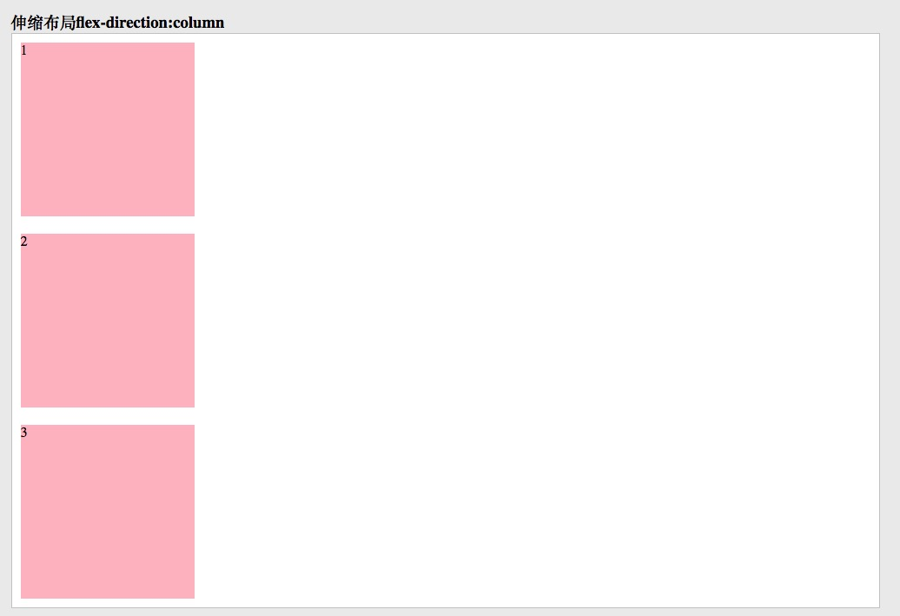

3. flex row reverse: 从右向左排列

      ```css
      section:nth-child(4) ul{
          /*让ul 采用伸缩布局*/
          display: flex;
          /* 主轴水平翻转*/
          flex-direction: row-reverse;
      }
      ```

      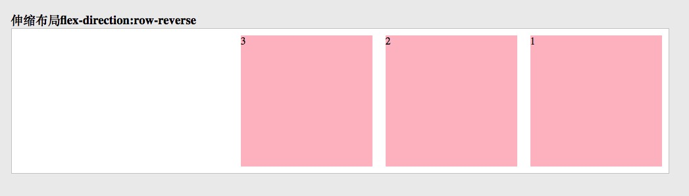

4. flex column reverse: 从下到上排列

      ```css
      section:nth-child(5) ul{
          /*让ul 采用伸缩布局*/
          display: flex;
          /* 主轴水平翻转*/
          flex-direction: column-reverse;
      }
      ```

      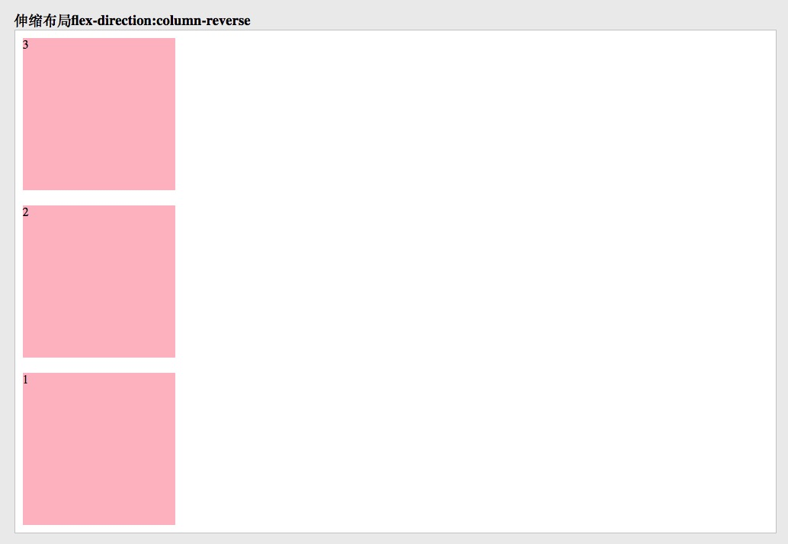

## 2. justify-content (横轴排列)

1. space-evenly

      ```css
      section:nth-child(6) ul {
          display: flex;
          /* 主轴对齐方式：平分*/
          justify-content: space-evenly;
      }
      ```

      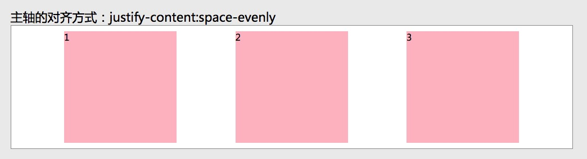

2. space-around

      ```css
      section:nth-child(4) ul {
          display: flex;
          /* 主轴对齐方式：在父盒子中平分*/
          justify-content: space-around;
      }
      ```

      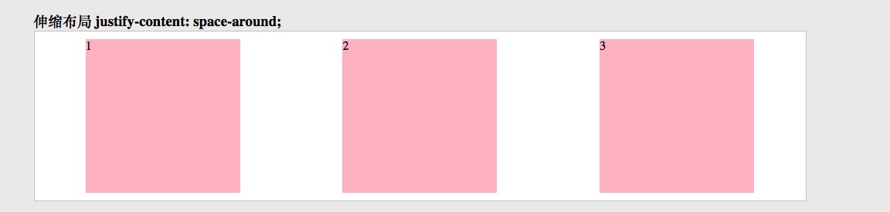

3. space-between

      ```css
      section:nth-child(5) ul {
          display: flex;
          /* 主轴对齐方式：两端对齐 平分*/
          justify-content: space-between;
      }
      ```

      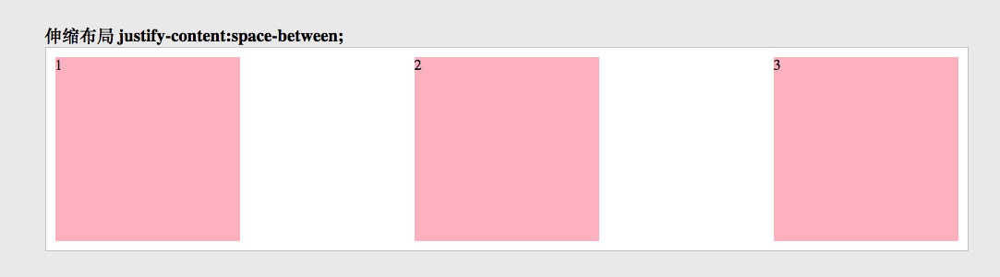

4. center

      ```css
      section:nth-child(3) ul {
          display: flex;
          /* 主轴对齐方式：居中对齐*/
          justify-content: center;
      }
      ```

      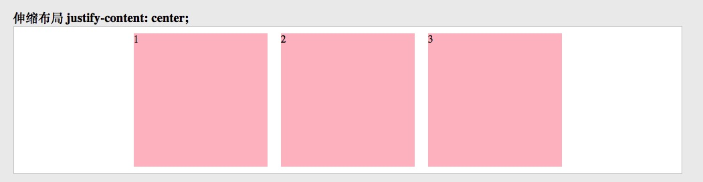

5. flex-end

      ```css
      section:nth-child(2) ul {
          diplay: flex;
          /* 主轴对齐方式：从主轴结束的方向对齐*/
          justify-content: flex-end;
      }
      ```

      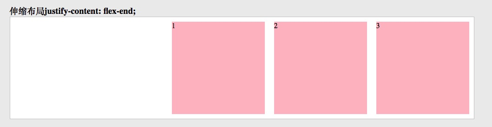

6. flex-start (default value)

      ```css
      section:nth-child(1) ul {
          display: flex;
          /* 主轴对齐方式：从主轴开始的方向对齐*/
          justify-content: flex-start;
      }
      ```

      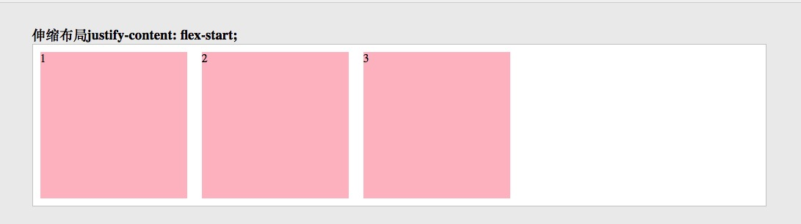

## 3. align-items (纵轴对齐)

pre-css:

```css
ul {
    border: 1px solid #999;
    background-color: #fff;
    display: flex;
    height: 500px;
}

ul li {
    width: 200px;
    height: 200px;
    background: pink;
    margin: 10px;

}
```

1. flex-start (default)

      ```css
      section:nth-child(1) ul {
          /* 侧轴对齐方式 ：从侧轴开始的方向对齐*/
          align-items: flex-start;
      }
      ```

      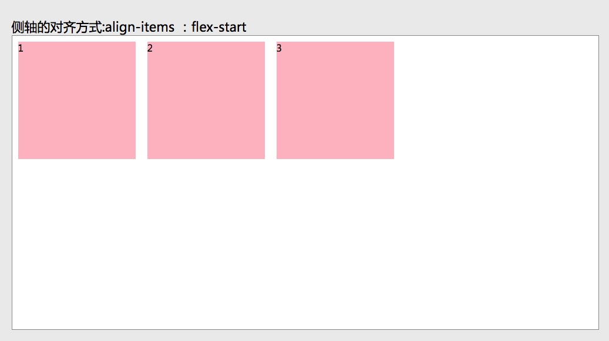

2. flex-end

      ```css
      section:nth-child(2) ul {
          /* 侧轴对齐方式 ：从侧轴结束的方向对齐*/
          align-items: flex-end;
      }
      ```

      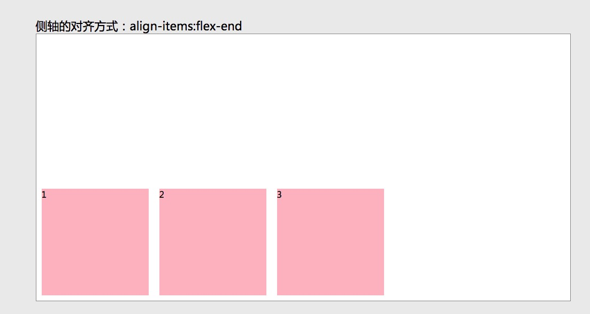

3. center

      ```css
      section:nth-child(3) ul {
          /* 侧轴对齐方式 ：居中*/
          align-items: center;
      }
      ```

      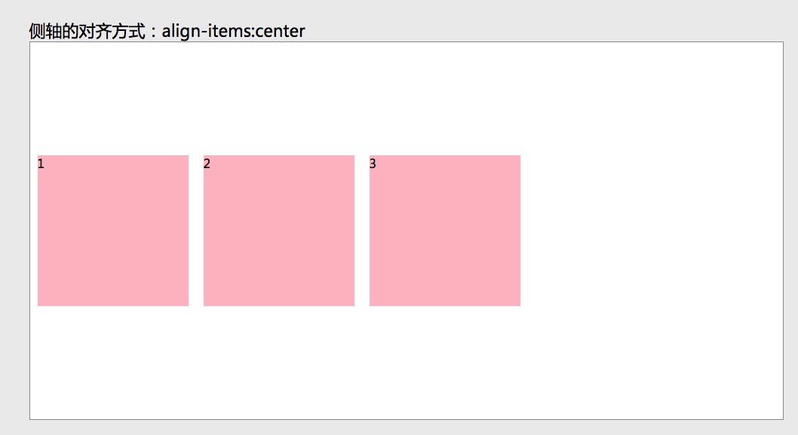

4. strech

      ```css
      section:nth-child(5) ul {
          /* 侧轴对齐方式 ：拉伸*/
          align-items: stretch;
      }
      ```

      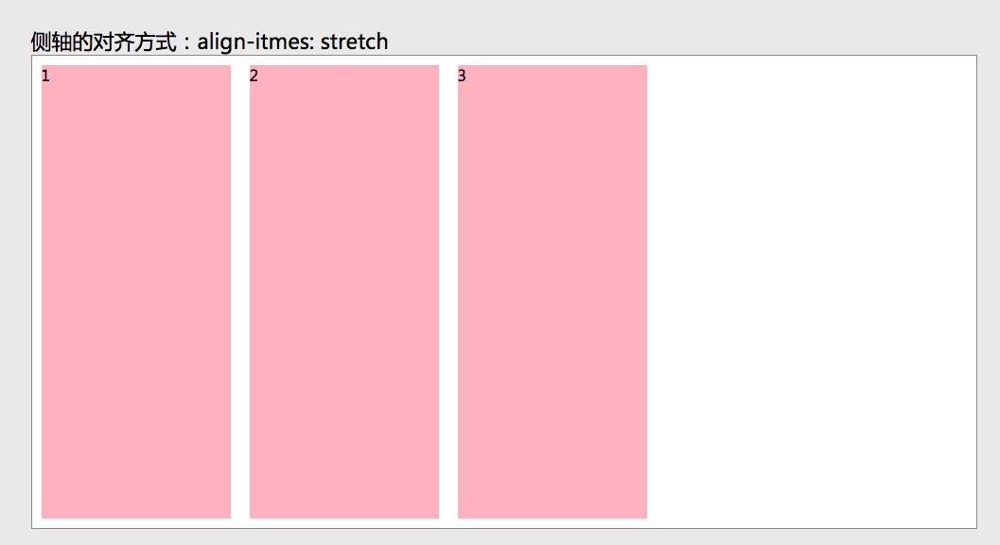

## 4. 按比例伸缩

Using `flex` can set up proportion of each element.

`flex: flex-grow | flex-shrink | flex-basis;`

example:

pre-css:

```css
ul{
    border: 1px solid #999;
    background-color: #fff;
    display: flex;
}

ul li{
    width: 200px;
    height: 200px;
    background: pink;
    margin:10px;
}
```

```css
section:nth-child(1) ul li:nth-child(1){
    flex:1;
}

section:nth-child(1) ul li:nth-child(2){
    flex:1;
}

section:nth-child(1) ul li:nth-child(3){
    flex:8;
}
```

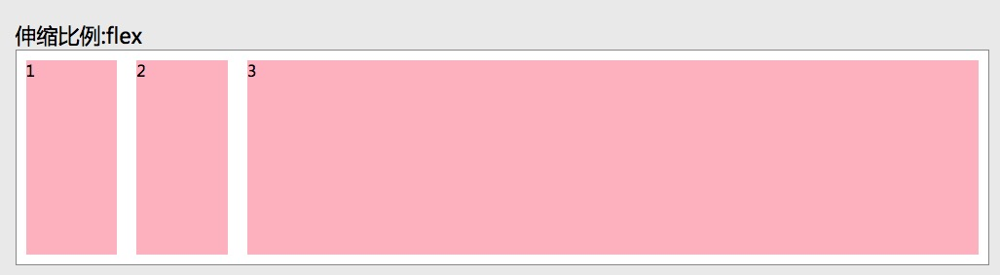

```css
section:nth-child(2) ul li:nth-child(1){
    /* empty means keep original and do not join this portion divide */
}

section:nth-child(2) ul li:nth-child(2){
    flex:1;
}

section:nth-child(2) ul li:nth-child(3){
    flex:4;
}
```

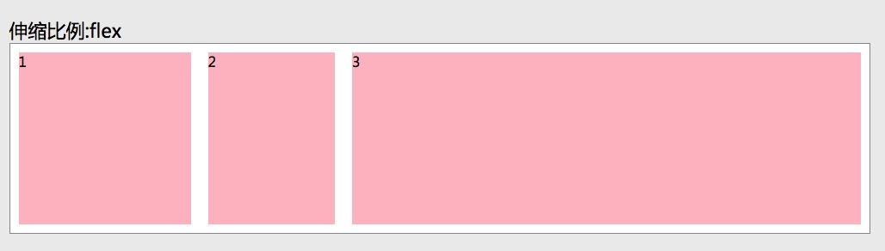

## 5. flex wrap

use flex-flow to define flex wrap property.

`flex-flow: flex-direction | flex-wrap`

example:

```css
.container {
    flex-flow: wrap;
    align-content: center;
}
```

Note:

- `align-content` always works together with `flex-flow: wrap` value. This defines the wrap space. Works like `align-item`.
