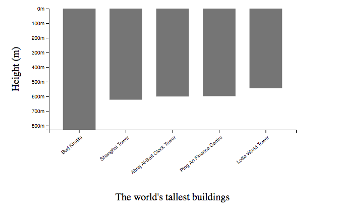

# Axis

## 0. 示例图片



## 1. add x and y axis

```js
const xAxisCall = d3.axisBottom(bandScale); // take scale as parameter
g.append('g')
    .attr('transform', `translate(0, ${height})`) // 下坐标轴需要手动移动到位置
    .call(xAxisCall) // use call to add the axis
    .selectAll('text') // 从这一步起, 是旋转坐标轴文字
    .attr('x', -5)
    .attr('y', 10)
    .attr('text-anchor', 'end')
    .attr('transform', 'rotate(-40)');

const yAxisCall = d3
    .axisLeft(heightScale)
    .ticks(3) // 坐标轴分成几段, 可能不会取到这个值本身, 但是会取附近最合理的值. 如果想自定义坐标轴, 用tickValues([])
    .tickFormat(d => d + 'm'); // format坐标轴文字
g.append('g').call(yAxisCall);
```

## 2. add text for your x and y axis

```js
g.append('text')
    .attr('x', width / 2)
    .attr('y', height + 140)
    .attr('font-size', '20px')
    .attr('text-anchor', 'middle')
    .text(`The world's tallest buildings`);

g.append('text')
    // .attr('x', -(height / 2))
    // .attr('y', -60)
    .attr('x', -60)
    .attr('y', height / 2)
    .attr('font-size', '20px')
    .attr('text-anchor', 'middle')
    .attr('transform', `rotate(-90, -60, ${height / 2})`)
    .text('Height (m)');
```
