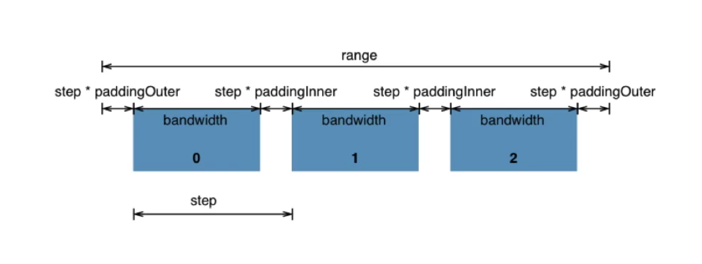

# Scale

## 0. `domain([])` and `range([])`

-   `domain([])` is the original **data** range.
-   `range([])` is the svg element (width/height/ **UI** data) range.

## 1. linear Scale(线性比例尺)

Use `d3.scaleLinear().domain([]).range([])`

```js
jsonArr.forEach((data: any, i: number) => {
    const heightScale = d3
        .scaleLinear()
        .domain([0, 828])
        .range([0, 400]);

    svg.append('rect')
        .attr('x', i * (25 + 10))
        .attr('y', 0)
        .attr('width', 25)
        .attr('height', heightScale(+data.height))
        .attr('fill', 'grey');
});
```

## 2. log scale

```js
const x = d3
    .scaleLog()
    .domain([300, 150000])
    .range([0, 400])
    .base(10);

console.log(x(500)); // 32.9
console.log(x(5000)); // 181.1
console.log(x(50000)); // 329.3

console.log(x.invert(32.9)); // 500
console.log(x.invert(181.1)); // 5000
console.log(x.invert(329.3)); // 50000
```

## 3. band scale

`scaleBand`: `d3.scaleBand()`并不是一个连续性的比例尺，`domain()`中使用一个数组，不过`range()`需要是一个连续域. We can also use `paddingInner` and `paddingOuter` to specify the out and inner padding. Note `paddingInner` and `paddingOuter` range are [0, 1]. We can also use `scale.bindwidth` to get each element's width.



```js
const x = d3
    .scaleBand()
    .domain(['1', '2', '3', '4'])
    .range([0, 400])
    .paddingInner(0) // padding range is [0, 1]
    .paddingOuter(0); // padding range is [0, 1]

console.log(x('1')); // 0
console.log(x('2')); // 100
console.log(x('3')); // 200
console.log(x('4')); // 300

console.log(x.bandwidth()); // 100
```

Note: 

-   the `paddingInner` is a ratio based on **step**. Step can be calculated by this: **(paddingInner+bandWidth)=step**.

-   the `paddingOuter` is a ratio based on whole **range([])**. for calculation, it is **paddingOuter=range/(domain.data.length+paddingOuterData*2) * paddingOuterData**. For example, if the above `paddingOuter(0.1)`, then `out padding = 400/(4+0.2)*0.1 = 9.52`
