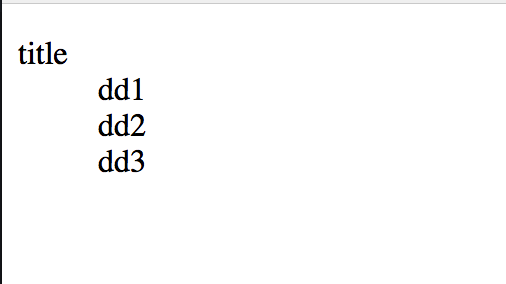

# dl

Under `dl`, we can use `dt` and `dd` tag. `dt` is just the title in this `dl`. `dd` is the content.

```html
<!DOCTYPE html>
<html lang="en">

<head>
  <meta charset="UTF-8" />
  <meta name="viewport" content="width=device-width, initial-scale=1.0" />
  <meta http-equiv="X-UA-Compatible" content="ie=edge" />
  <title>Document</title>
</head>

<body>
  <dl>
    <dt>title</dt>
    <dd>dd1</dd>
    <dd>dd2</dd>
    <dd>dd3</dd>
  </dl>
</body>

</html>
```

preview:

