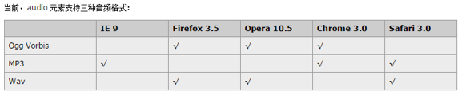

# Audio

## 1. basic

```html
<audio src="./resource/music/See You Again.mp3" controls autoplay></audio>
```

Note:

- `autoplay`: 自动播放
- `controls` 是否显不默认播放控件
- `loop` 循环播放
- `preload` 预加载 同时设置autoplay时些属性失效
- **audio is inline-block element**.

## 2. compatibility



resolve:

```html
<audio controls loop>
  <source src="./resource/music/See You Again.mp3" />
  <source src="./resource/music/See You Again.wav" />
  <source src="./resource/music/See You Again.ogg" />
  <output>浏览器不支持html音频播放</output>
</audio>
```
