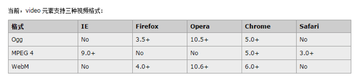

# Video

## 1. basic

```html
<video src="./resource/video/movie.mp4" autoplay controls></video>
```

Note:

- `autoplay` 自动播放
- `controls` 是否显示默认播放控件
- `loop` 循环播放
- `preload` 预加载，同时设置了autoplay，此属性将失效
- `width` 设置播放窗口宽度
- `height` 设置播放窗口的高度
- **video is inline-block element**.

## 2. compatibility



resolve:

```html
<video controls>
  <source src="./resource/video/movie.ogg" />
  <source src="./resource/video/movie.mp4" />
  <output>浏览器不支持html视频播放</output>
</video>
```

## 3. Js control video

方法：

- load() 加载
- play() 播放
- pause() 暂停

属性:

- `currentTime`: 视频播放的当前进度、
- `duration`:视频的总时间
- `paused`:视频播放的状态.

事件:

- `oncanplay`: 事件在用户可以开始播放视频/音频(audio/video)时触发.
- `ontimeupdate`:通过该事件来报告当前的播放进度.
- `onended`:播放完时触发.

```js
playBtn.onclick=function(){
    if(video.paused){
        video.play();
        this.classList.remove('icon-play');
        this.classList.add('icon-pause');
    }else{
        video.pause();
        this.classList.remove('icon-pause');
        this.classList.add('icon-play');
    }
}

video.oncanplay=function(){

    //获取视频的总时长
    Ttime=video.duration;
    //转换成十分秒的格式
    var h=Math.floor(Ttime/3600);
    var m=Math.floor(Ttime%3600/60);
    var s=Math.floor(Ttime%60);

    h=h>10?h:'0'+h;
    m=m>10?m:'0'+m;
    s=s>10?s:'0'+s;

    totaltime.innerHTML=h+':'+m+':'+s;
}

video.ontimeupdate=function(){

    var Ctime=video.currentTime;

    //转换成十分秒的格式
    var h=Math.floor(Ctime/3600);
    var m=Math.floor(Ctime%3600/60);
    var s=Math.floor(Ctime%60);

    h=h>10?h:'0'+h;
    m=m>10?m:'0'+m;
    s=s>10?s:'0'+s;

    currTime.innerHTML=h+':'+m+':'+s;

    //动态改变进度条
    var value=Ctime/Ttime;
    currProgress.style.width=value*100+"%";
}

//全屏
extend.onclick=function(){
    video.webkitRequestFullScreen();
}
```