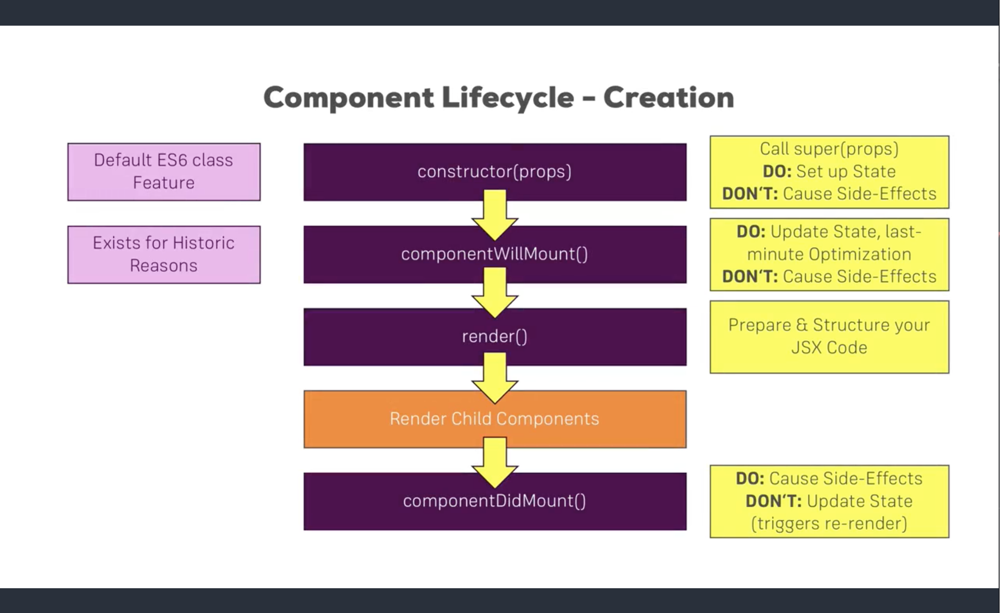

# Life Cycle

## 1. Life Cycle (Mounting)

The Life cycle for react mount is `constructor()` => `static getDerivedStateFromProps()` => `componentWillMount() (UNSAFE)` => `render()` => `Render Child Component` => `componentDidMount()`.

## 2. Life Cycle (Updating)

The life cycle for react update is `componentWillReceiveProps() (UNSAFE)` => `static getDerivedStateFromProps()` => `shouldComponentUpdate()` => `componentWillUpdate() (UNSAFE)` => `render()` => `getSnapshotBeforeUpdate()` => `componentDidUpdate()`

Note:

*   **You cannot use this.setState() in `componentWillUpdate` method. If you need to update state in response to a prop change, use `getDerivedStateFromProps()` instead.**

## 3. Error handling

Only this one: `componentDidCatch()`
