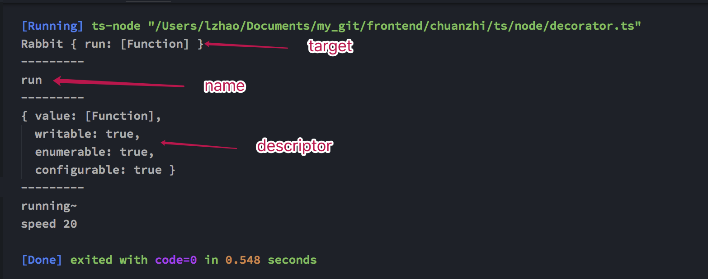

# Decorator

## 1. usage

```ts
const fast = (target: any, propertyKey: string, descriptor: PropertyDescriptor) => {
    console.log(target);
    console.log('---------');
    console.log(propertyKey);
    console.log('---------');
    console.log(descriptor);
    console.log('---------');
    target.speed = 20;
    let run = descriptor.value;
    descriptor.value = function () {
        run();
        console.log(`speed ${this.speed}`);
    };
}

class Rabbit {
    @fast
    run() {
        console.log("running~");
    }
}

let bunny = new Rabbit();
bunny.run();
```

result:



descriptor properties:

- `value`
    The value associated with the property. Can be any valid JavaScript value (number, object, function, etc).

    **`Defaults` to `undefined`**

- `writable`
    `true` if and only if the value associated with the property may be changed with an assignment operator.

    **`Defaults` to `false`.**

- `configurable`
    `true` if and only if the type of this property descriptor may be changed and if the property may be deleted from the corresponding object.

    **`Defaults` to `false`.**

- `enumerable`
    `true` if and only if this property shows up during enumeration of the properties on the corresponding object.

    **`Defaults` to `false`**

- `get`

    A function which serves as a getter for the property, or `undefined` if there is no getter. When the property is accessed, this function is called without arguments and with `this` set to the object through which the property is accessed (this may not be the object on which the property is defined due to inheritance). The return value will be used as the value of the property.

    **`Defaults` to `undefined`.**

- `set`

    A function which serves as a setter for the property, or `undefined` if there is no setter. When the property is assigned to, this function is called with one argument (the value being assigned to the property) and with this set to the object through which the property is assigned.

    **`Defaults` to `undefined`.**